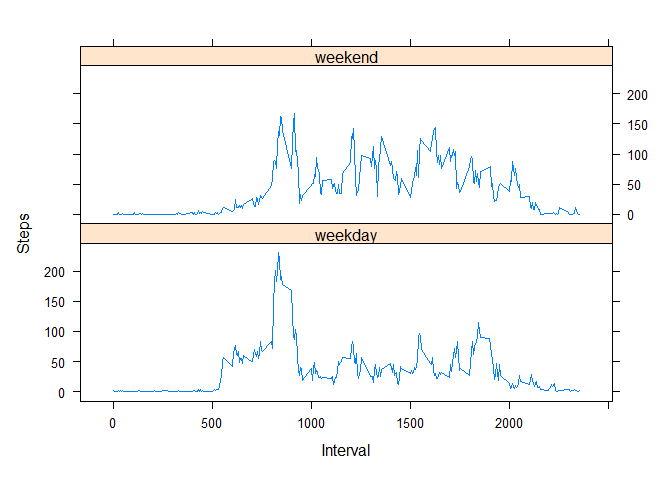

## tasks
1.Code for reading in the dataset and/or processing the data
2.Histogram of the total number of steps taken each day
3.Mean and median number of steps taken each day
4.Time series plot of the average number of steps taken
5.The 5-minute interval that, on average, contains the maximum number of steps
6.Code to describe and show a strategy for imputing missing data
7.Histogram of the total number of steps taken each day after missing values are imputed
8.Panel plot comparing the average number of steps taken per 5-minute interval across weekdays and weekends
9.All of the R code needed to reproduce the results (numbers, plots, etc.) in the report


## Loading and preprocessing the data
## 1.Code for reading in the dataset and/or processing the data

```r
activity <- read.csv("./activity.csv")
head(activity)
```

```
##   steps       date interval
## 1    NA 2012-10-01        0
## 2    NA 2012-10-01        5
## 3    NA 2012-10-01       10
## 4    NA 2012-10-01       15
## 5    NA 2012-10-01       20
## 6    NA 2012-10-01       25
```

```r
dim(activity)
```

```
## [1] 17568     3
```

```r
summary(activity)
```

```
##      steps            date              interval     
##  Min.   :  0.00   Length:17568       Min.   :   0.0  
##  1st Qu.:  0.00   Class :character   1st Qu.: 588.8  
##  Median :  0.00   Mode  :character   Median :1177.5  
##  Mean   : 37.38                      Mean   :1177.5  
##  3rd Qu.: 12.00                      3rd Qu.:1766.2  
##  Max.   :806.00                      Max.   :2355.0  
##  NA's   :2304
```

```r
names(activity)
```

```
## [1] "steps"    "date"     "interval"
```

## What is mean total number of steps taken per day?
## 2.Histogram of the total number of steps taken each day

```r
library(ggplot2)
total_steps <- aggregate(steps ~ date, activity, sum, na.rm = TRUE)
q2_hist <- ggplot(total_steps, aes(x = steps))
q2_hist + geom_histogram(fill = "brown", binwidth = 1200) + labs(title = "Histogram of the total number of steps taken each day", x = "Steps", y = "Frequency")
```

<!-- -->

## 3.Mean and median number of steps taken each day

```r
mean_steps <- mean(total_steps$steps, na.rm = TRUE)
mean_steps
```

```
## [1] 10766.19
```

```r
med_steps <- median(total_steps$steps, na.rm = TRUE)
med_steps
```

```
## [1] 10765
```

## What is the average daily activity pattern?
## 4.Time series plot of the average number of steps taken

```r
time_series_steps <- aggregate(steps ~ interval, activity, mean, na.rm = TRUE)
q4_plot <- ggplot(time_series_steps, aes(x = interval, y = steps))
q4_plot + geom_line() + labs(title = "Time series plot of the average number of steps taken", x = "Interval", y = "Steps")
```

<!-- -->
## 5.The 5-minute interval that, on average, contains the maximum number of steps

```r
max_steps <- time_series_steps[which.max(time_series_steps$steps), ]
max_steps
```

```
##     interval    steps
## 104      835 206.1698
```


## Imputing missing values
## 6.Code to describe and show a strategy for imputing missing data

```r
miss_data <- sum(is.na(activity$steps))
miss_data
```

```
## [1] 2304
```
## 7.Histogram of the total number of steps taken each day after missing values are imputed

```r
func <- function(interval) {
  time_series_steps[time_series_steps$interval == interval, ]$steps
}
no_na_activity <- activity
for(i in 1:nrow(no_na_activity)) {
  if(is.na(no_na_activity[i, ]$steps)) {
    no_na_activity[i, ]$steps <- func(no_na_activity[i, ]$interval)
  }
}
no_na_total_steps <- aggregate(steps ~ date, no_na_activity, sum)
q7_hist <- ggplot(no_na_total_steps, aes (x = steps))
q7_hist + geom_histogram(fill = "brown", binwidth = 1200) + labs(title = "Histogram of the total number of steps taken each day no NA", x = "Steps", y = "Frequency")
```

<!-- -->

```r
no_na_mean_steps <- mean(no_na_total_steps$steps, na.rm = TRUE)
no_na_mean_steps
```

```
## [1] 10766.19
```

```r
no_na_median_steps <- median(no_na_total_steps$steps, na.rm = TRUE)
no_na_median_steps
```

```
## [1] 10766.19
```

## Are there differences in activity patterns between weekdays and weekends?
## 8.Panel plot comparing the average number of steps taken per 5-minute interval across weekdays and weekends

```r
library(lattice)
no_na_activity$date <- as.Date(strptime(no_na_activity$date, format="%Y-%m-%d"))
no_na_activity$day <- weekdays(no_na_activity$date)
for (i in 1:nrow(no_na_activity)) {
    if (no_na_activity[i,]$day %in% c("土曜日","日曜日")) {
        no_na_activity[i,]$day<-"weekend"
    }
    else{
        no_na_activity[i,]$day<-"weekday"
    }
}
q8_plot <- aggregate(no_na_activity$steps ~ no_na_activity$interval + no_na_activity$day, no_na_activity, mean)
names(q8_plot) <- c("interval", "day", "steps")
xyplot(steps ~ interval | day, q8_plot, type = "l", layout = c(1, 2), 
    xlab = "Interval", ylab = "Steps")
```

<!-- -->


